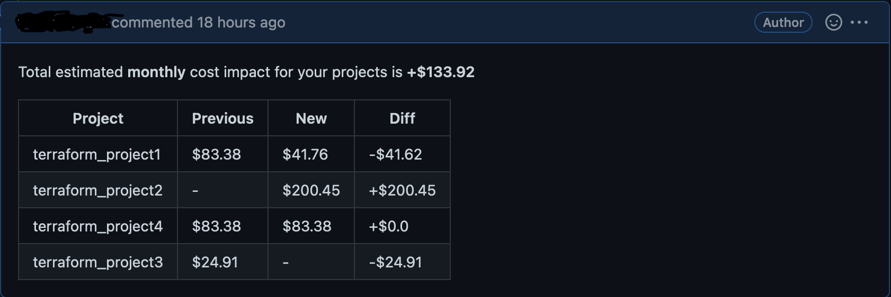
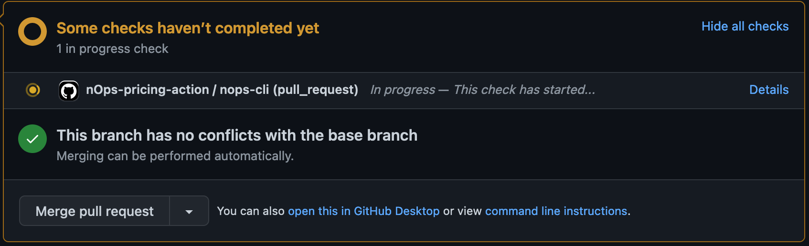

# nOps CLI
nOps CLI can be independently installed and executed.

## How to install
1. Clone repo [https://github.com/nops-io/nops-precommit-client.git](https://github.com/nops-io/nops-precommit-client.git)
2. Checkout to git directory
3. Run following command to install nops-cli and dependencies. Make sure you are using
python3.9 or above.
```shell
pip3 install .
```
4. Set required enviornment variables
     - **NOPS_API_KEY** - Your nOps account API key.
     - **AWS_REGION** - Set AWS region.

## How to run
```CLI Help
terminal#nops-cli  --help                                                                                              
usage: nops-cli [-h] [--pricing] [--dependency] [--iac-type {terraform}] [--periodicity {hourly,daily,monthly,yearly}] [--github_action] [--token TOKEN] [--pr_number PR_NUMBER]
                [--repo_name REPO_NAME] [--json_out_file JSON_OUT_FILE] [--json_in_file JSON_IN_FILE]
                [filenames ...]

positional arguments:
  filenames             Space separated terraform plans(.tf) files

optional arguments:
  -h, --help            show this help message and exit
  --pricing             Get Pricing Projection
  --dependency          Get Dependencies
  --iac-type {terraform}
                        IAC type
  --periodicity {hourly,daily,monthly,yearly}
                        Select periodicity for pricing projection
  --github_action       Executing script using Github Actions
  --token TOKEN         Github Access Token
  --pr_number PR_NUMBER
                        Github Pull Request Number
  --repo_name REPO_NAME
                        Github Repository Owner and Name. eg. nops-io/nops-test-repo-name
  --json_out_file JSON_OUT_FILE
                        Out file to add project cost outputs in JSON format. This file can be used to compute the comparative cloud cost impact in later run
  --json_in_file JSON_IN_FILE
                        File having the project cost in JSON format from previous run. (file generated by --json_out_file)
terminal#
```


# nOps pre-commit hooks
To use nOps hook with pre-commit, 
1. Make sure you have already installed the nops-cli or Please refer above section to setup the nops-cli on your machine.
2. You need to have the pre-commit package manager installed. Use following pip command to
install pre-commit.
```shell
pip3 install pre-commit
```
2. Create a file named .pre-commit-config.yaml
3. Copy the content from [.pre-commit-config.yaml](.pre-commit-config.yaml) file 
to .pre-commit-config.yaml file in your repo.
4. Update the args if required.
5. Run `pre-commit install` to set up the git hook scripts.
6. Now pre-commit will run automatically on `git commit`. It will run pricing and resource dependency pre commit hooks when you make terraform code changes and commit them.
It will ignore non-terraform code changes. nops pre-commit hooks will be skipped in this case.


# nOps Github Action
nOps Github Action will help you to get the estimated cost impact for your IAC(currently we are 
supporting terraform only) projects impacted by Github pull request code changes. It will run cloud
pricing checks when you make the pull request code changes for your IAC projects configured as a 
part of nOps-action.yml.


# How to use
To use nOps Github action: 
1. Create a **.github/workflows** directory in your repository on GitHub if this directory does not already exist.
```shell
cd ${GITHUB_REPOSITORY}
mkdir -p .github/workflows
```
2. In the .github/workflows directory, create a file named nOps-action.yml. 
3. Copy the **[nOps-action.yml](nOps-action.yml)** YAML contents into the nOps-action.yml file. 
4. Configure the list of terraform project as a space separated values in yml for TERRAFORM_PROJECT. 
5. Add following required secrets in github. [Please refer to add Github secrets](https://docs.github.com/en/actions/security-guides/encrypted-secrets)
     - **ACCESS_TOKEN_GITHUB** - Your personal github action token. nOps action will use this token to add the comment on you Pull Request.
     - **NOPS_API_KEY** - Your nOps account API key .
     - **NOPS_AWS_ACCESS_KEY** - Any valid AWS_ACCESS_KEY. This key is required for terraform.
     - **NOPS_AWS_SECRET_KEY** - Any valid AWS_SECRET_ACCESS_KEY.  This key is required for terraform.
     - **NOPS_AWS_REGION** - AWS region. This region is required for terraform and nOps sdk.
6. We are ready to create/update the pull requests and Github will trigger the nOps action for it 
 once we complete above steps.

